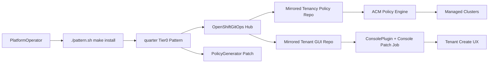
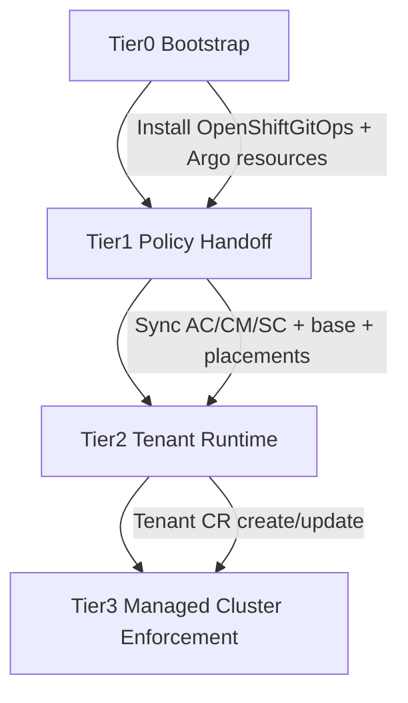
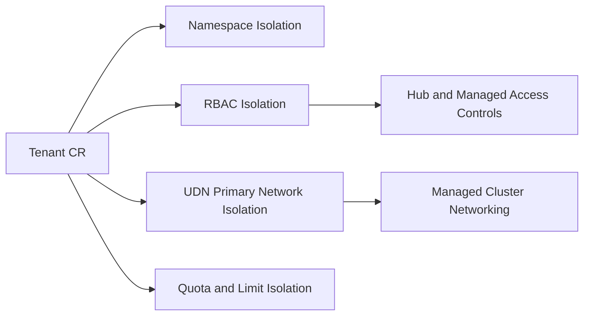

# quarter — ACM multi-tenant isolation pattern

This Red Hat Validated Pattern provides a Tier 0 root of trust to bootstrap an OpenShift hub cluster and orchestrate multi-tenant isolation across a managed fleet.

It uses a handoff model to deliver tenancy policy and tenant-management UX from external, customer-owned repositories.

## The problem

Operating multi-tenant platforms across a managed fleet often leads to configuration drift: tenant boundaries, RBAC, quotas, and network controls evolve differently across clusters and teams.

This pattern provides a consistent GitOps control point for tenancy operations while allowing each customer to tailor tenancy logic to their environment.

## Mental model: the Tier 0 handoff

`quarter` is the bootstrap and orchestration layer, not the tenancy-logic layer.

It establishes hub-side GitOps control, then hands off to a specialized repository:

**Tenancy policy logic**: [tenancy-by-acm-policy](https://github.com/ngner/tenancy-by-acm-policy)

This separation is intentional. Customers can evolve tenancy guardrails, policy content, and UX without forking the Tier 0 bootstrap pattern itself.

**Tenancy GUI Form Plugin form**: Fork and update this if you decided to adapt the Tenant CRD and bake your own console plugin.
- GUI source: `https://github.com/ngner/tenant-form-acm-gui` (dynamic console plugin)

## Setup

Repository URLs and revisions are configurable in `values-global.yaml`.

## Quick install

```bash
./pattern.sh make install
```

This command renders and applies the Tier 0 hub resources from `charts/hub/quarter-tenancy`.

## Architecture



## Data flow summary

| Step | Stage | Outcome |
| --- | --- | --- |
| 1 | Tier 0 bootstrap | Creates AppProject, patches `openshift-gitops` repo-server for PolicyGenerator, defines tenancy Applications |
| 2 | GitOps handoff | Argo CD syncs external policy repo paths for `tenancies`, `placements`, and AC/CM/SC families |
| 3 | Policy generation | PolicyGenerator renders ACM `Policy`/`PlacementBinding`/`PolicySet` resources |
| 4 | Policy enforcement | ACM policy engine enforces tenant namespaces, RBAC, quotas, UDN, and related resources on managed clusters |
| 5 | Tenant operations | GUI app deploys and registers a `ConsolePlugin`; users create `Tenant` CRs through the hub console |

## Tiered deployment flow



## Multi-tenant isolation layers



Isolation defaults:

- **Namespace:** tenant workload boundaries
- **RBAC:** tenant-admin/tenant-user/tenant-viewer group bindings
- **UDN:** primary tenant network isolation layer
- **Quotas:** tenant budget and max VM sizing controls

## PolicyGenerator ArgoCD install

`quarter` includes an `ArgoCD` patch that installs the PolicyGenerator binary into the `openshift-gitops` repo-server and enables alpha plugins.

Source values:

- `global.policyGenerator.acmSubscriptionImage`
- `global.policyGenerator.binarySourcePath`
- `global.policyGenerator.binaryTargetPath`

## NIST metadata preservation

Control-family metadata is preserved by syncing original policy family paths from the external policy repo:

- `policygen/AC-Access-Control`
- `policygen/CM-Configuration-Management`
- `policygen/SC-System-and-Communications-Protection`

Details: `docs/nist-mapping.md`

## Secret management transition (abstraction-first)

The pattern defines a backend-agnostic secret interface in `values-global.yaml`:

- `global.secrets.backend` (`abstract`, `vault`, `external-secrets`)
- `global.secrets.keycloak.*` logical key destination
- `global.secrets.vault.*` adapter settings
- `global.secrets.externalSecrets.*` adapter settings

Current behavior:

- `abstract` backend is default for sandbox migration safety.
- Vault and External Secrets adapters are available but opt-in.
- No hardcoded secret values are committed by this Tier 0 repo.

## GUI image usage model

- **Testing/default flow:** use prebuilt image from external GUI deployment manifests.
- **Production recommendation:** set a curated image tag and maintain your own image release process.
- No local image build is required to register the plugin in `console.operator/cluster`.

## Verification commands

```bash
make lint
make render
```

After cluster deployment:

```bash
oc get applications -n openshift-gitops
oc get consoleplugins
```

## Uninstall

```bash
./pattern.sh make uninstall
```

## Tested-tier readiness backlog

Tested-tier preparation artifacts are tracked in:

- `tests/test-plan.md`
- `tests/latest-results.json`
- `docs/tested-tier-roadmap.md`


