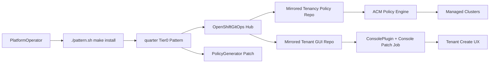
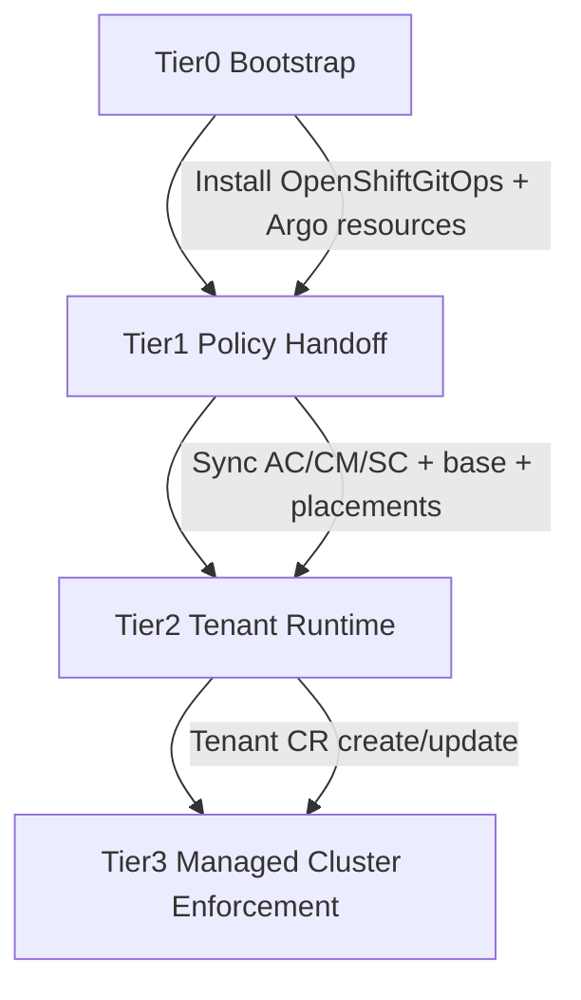
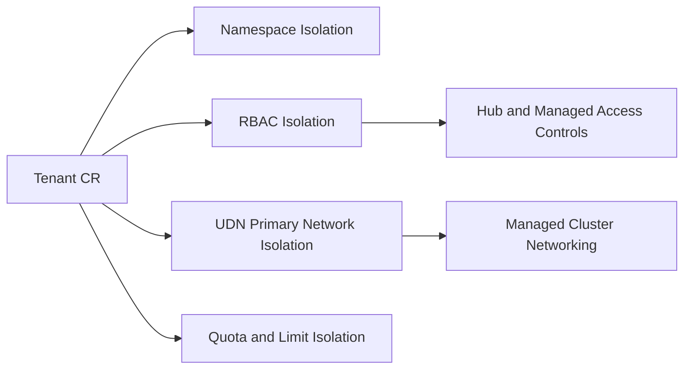

# quarter

`quarter` is a Tier 0 Validated Pattern for ACM-driven multi-tenant platform operations.

It bootstraps an OpenShift hub cluster with core GitOps prerequisites and then hands off tenancy policy and tenant lifecycle UX to external component repositories.

## Problem statement

Platform teams need a repeatable way to create isolated tenants across managed clusters without hand-applying manifests. Existing tenancy assets already exist, but they need a single bootstrap entrypoint that:

- deploys on a fresh OpenShift hub cluster,
- preserves policy semantics and compliance metadata,
- enables tenant operations through a GUI,
- avoids creating a parallel implementation that drifts from source logic.

`quarter` solves this by acting as the Tier 0 control plane pattern and delegating tenancy logic to external upstream repos through GitOps.

## Support policy

- **Tier:** Sandbox (community entry tier)
- **Support model:** Community / best effort
- **Escalation model:** Framework issues should be raised against Validated Patterns framework repositories; tenancy feature issues should be raised against the external component repositories.

## Repository model

This repository intentionally keeps source logic in component repositories and only defines hub bootstrap and GitOps handoff:

- Policy source: `https://github.com/ngner/tenancy-by-acm-policy` (tenancy policies and PolicyGenerator manifests)
- GUI source: `https://github.com/ngner/tenant-form-acm-gui` (dynamic console plugin)

Repository URLs and revisions are configurable in `values-global.yaml`.

## Quick install

```bash
./pattern.sh make install
```

This command renders and applies the Tier 0 hub resources from `charts/hub/quarter-tenancy`.

## Architecture



## Data flow summary

| Step | Stage | Outcome |
| --- | --- | --- |
| 1 | Tier 0 bootstrap | Creates AppProject, patches `openshift-gitops` repo-server for PolicyGenerator, defines tenancy Applications |
| 2 | GitOps handoff | Argo CD syncs external policy repo paths for `tenancies`, `placements`, and AC/CM/SC families |
| 3 | Policy generation | PolicyGenerator renders ACM `Policy`/`PlacementBinding`/`PolicySet` resources |
| 4 | Policy enforcement | ACM policy engine enforces tenant namespaces, RBAC, quotas, UDN, and related resources on managed clusters |
| 5 | Tenant operations | GUI app deploys and registers a `ConsolePlugin`; users create `Tenant` CRs through the hub console |

## Tiered deployment flow



## Multi-tenant isolation layers



Isolation defaults:

- **Namespace:** tenant workload boundaries
- **RBAC:** tenant-admin/tenant-user/tenant-viewer group bindings
- **UDN:** primary tenant network isolation layer
- **Quotas:** tenant budget and max VM sizing controls

## PolicyGenerator hardening

`quarter` includes an `ArgoCD` patch that installs the PolicyGenerator binary into the `openshift-gitops` repo-server and enables alpha plugins.

Source values:

- `global.policyGenerator.acmSubscriptionImage`
- `global.policyGenerator.binarySourcePath`
- `global.policyGenerator.binaryTargetPath`

## NIST metadata preservation

Control-family metadata is preserved by syncing original policy family paths from the external policy repo:

- `policygen/AC-Access-Control`
- `policygen/CM-Configuration-Management`
- `policygen/SC-System-and-Communications-Protection`

Validation command:

```bash
make verify-nist
```

Details: `docs/nist-mapping.md`

## Secret management transition (abstraction-first)

The pattern defines a backend-agnostic secret interface in `values-global.yaml`:

- `global.secrets.backend` (`abstract`, `vault`, `external-secrets`)
- `global.secrets.keycloak.*` logical key destination
- `global.secrets.vault.*` adapter settings
- `global.secrets.externalSecrets.*` adapter settings

Current behavior:

- `abstract` backend is default for sandbox migration safety.
- Vault and External Secrets adapters are available but opt-in.
- No hardcoded secret values are committed by this Tier 0 repo.

## GUI image usage model

- **Testing/default flow:** use prebuilt image from external GUI deployment manifests.
- **Production recommendation:** set a curated image tag and maintain your own image release process.
- No local image build is required to register the plugin in `console.operator/cluster`.

## Verification commands

```bash
make lint
make render
make verify-nist
```

After cluster deployment:

```bash
oc get applications -n openshift-gitops
oc get consoleplugins
```

## Uninstall

```bash
./pattern.sh make uninstall
```

## Tested-tier readiness backlog

Tested-tier preparation artifacts are tracked in:

- `tests/test-plan.md`
- `tests/latest-results.json`
- `docs/tested-tier-roadmap.md`

## References

- [Sandbox tier nomination and requirements](https://validatedpatterns.io/contribute/sandbox/#nominating-a-pattern-for-sandbox-tier)
- [Validated pattern tiers in depth](https://validatedpatterns.io/learn/about-pattern-tiers-types/)
- [Structuring a validated pattern](https://validatedpatterns.io/learn/vp_structure_vp_pattern/)
- [Tier 0 bootstrap handoff run](6d03b1e2-7dfa-4221-bda4-02a87e2664db)

## Why this is not simpler

The earlier Tier 0 handoff run shows the right high-level model: one Tier 0 pattern bootstraps, then GitOps handoff applies downstream repos. This implementation already follows that shape.

What cannot be simplified further without reducing reliability is the internal sequencing:

- PolicyGenerator plugin patch must be applied before policy-family applications render.
- GUI plugin registration requires explicit patching of `console.operator/cluster` plugin list.
- AC/CM/SC are kept as explicit Argo applications to preserve predictable sync order and failure visibility.

A single opaque handoff application is possible, but it weakens deterministic first-sync behavior for this tenancy stack.
